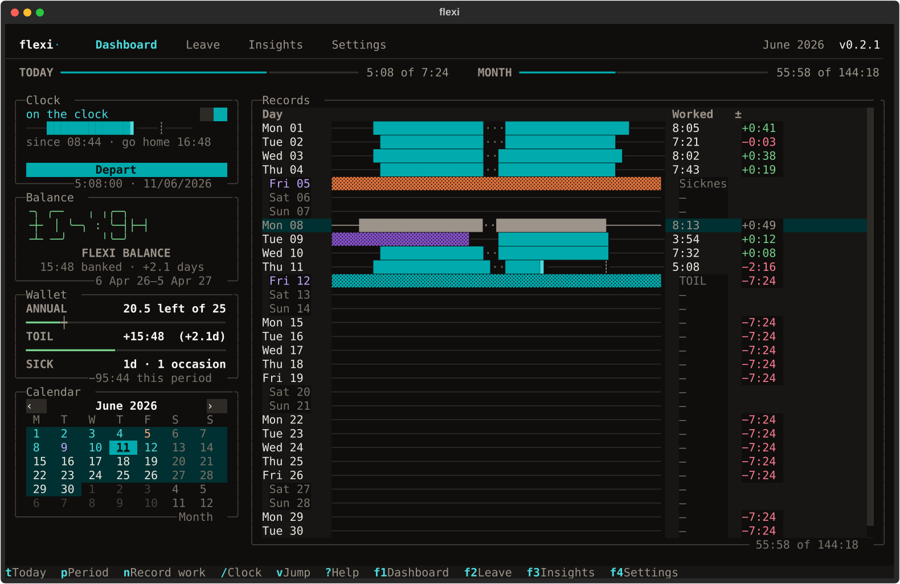
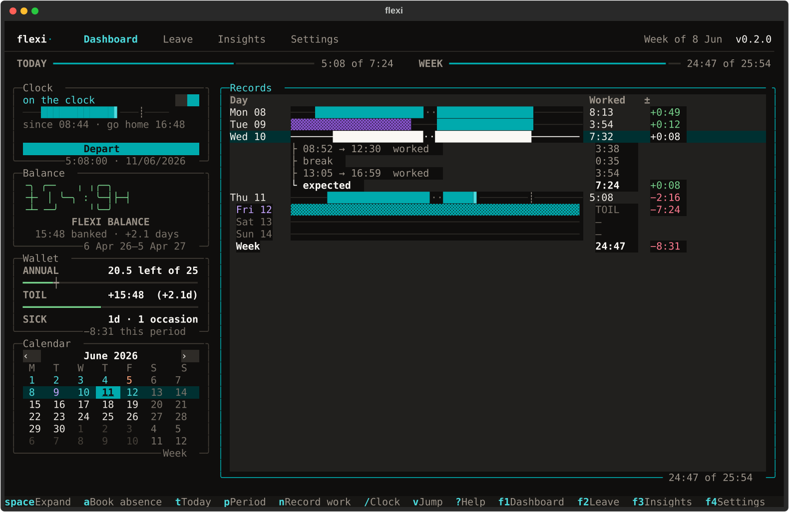
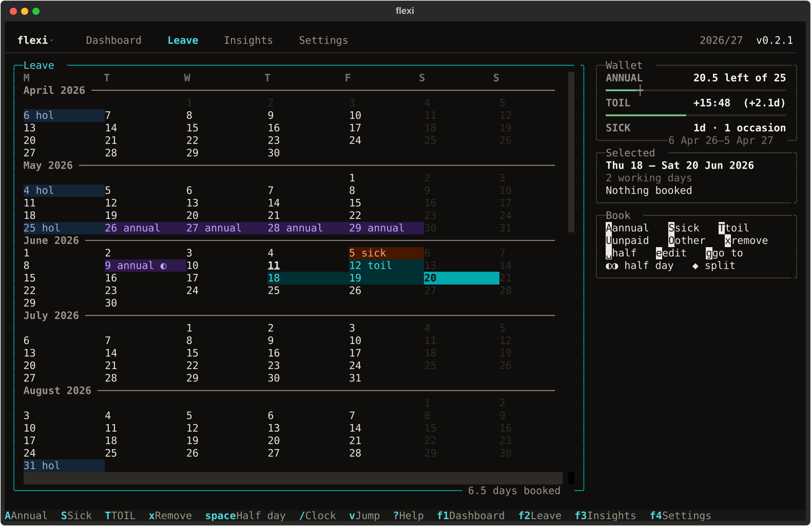
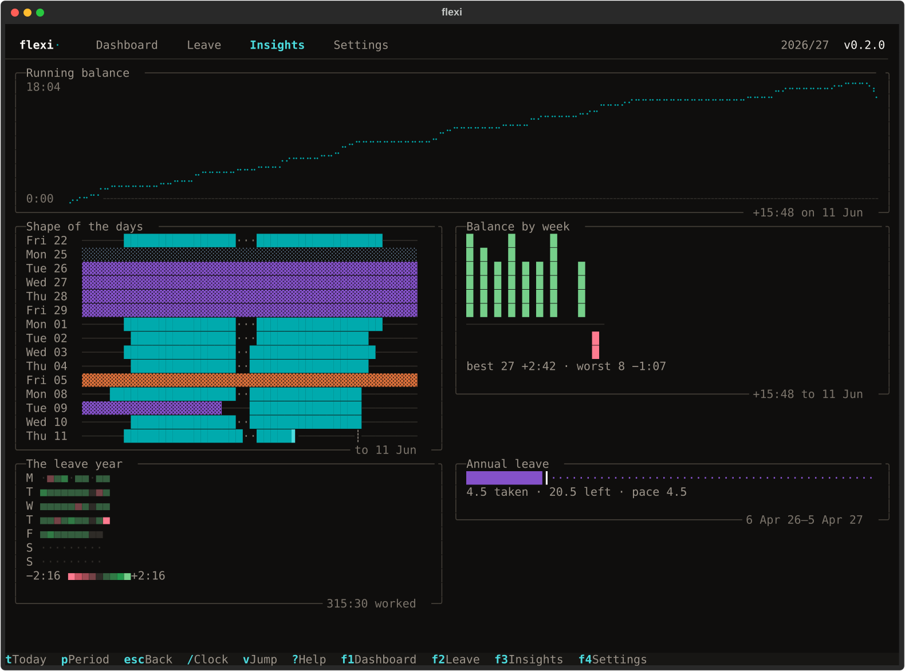
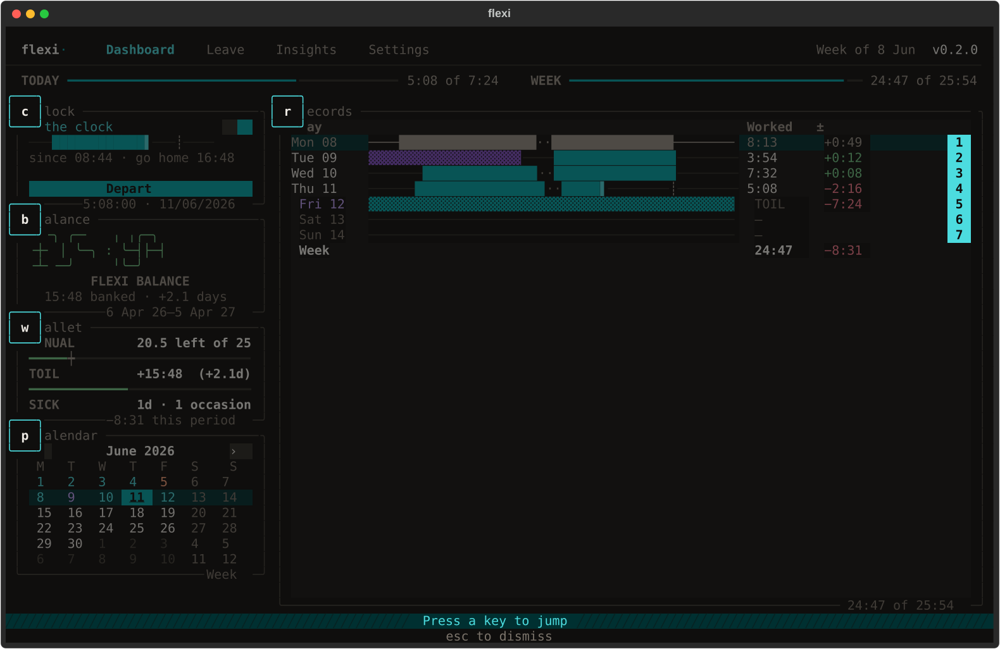

# ⏱️ flexi

A terminal timesheet for people on flexitime. It knows what time off in lieu is, and that your leave year probably starts in April.

[](https://pypi.org/project/flexi/)
[](https://www.python.org)
[](https://textual.textualize.io)
[](https://www.sqlite.org)
[](https://docs.astral.sh/uv/)

[](https://github.com/ellsphillips/flexi/actions/workflows/ci.yaml)
[](https://mypy-lang.org)
[](https://github.com/astral-sh/ruff)
[](LICENSE)
[](CONTRIBUTING.md)



That is the dashboard: a fortnight of days beside where the balance stands.

If your employer runs a flexitime scheme you already know the arithmetic. Contracted hours a day, a balance you are allowed to carry, TOIL you can take back as leave. Most people keep it in a spreadsheet and find out in March that they have three days to burn.

Flexi is built for that scheme rather than for time tracking in general. TOIL comes out of the same balance overtime goes into. The leave year starts on the 6th of April, or wherever you put it. It fetches bank holidays from GOV.UK and refuses to book annual leave on one.

Your records live in one SQLite file on your own disk. There is no account and no server.

If you have [uv](https://docs.astral.sh/uv/), you can have a look around right now without installing anything or touching your own data:

```bash
uvx flexi --demo
```

## A look around

### On the clock

Press `/`. You are on the clock. Press it again and you are off. The status bar says what it recorded and at what time, and that is the whole confirmation: clock events are immutable, so a mistaken `/` costs you one visible break rather than a dialog you would have clicked through anyway.

A session left running past midnight is closed for you at the auto-close time you chose, or at 23:59 if you clocked in later than it. The row says so, in as many words, because a day you did not end yourself is a day worth a second look. Today's session is left alone however long it runs.

Each day is drawn as a punch strip. Cells across the working day, filled where you were on the clock, with a tick where your contracted hours are met. Stack a week on one time axis and the shape of how you have been working is obvious. A column of totals never shows you that.

Absence comes in five kinds: annual, sick, TOIL, unpaid, other. Any of them can be a whole day or half of one, and two halves can share a date. People do go home ill at lunchtime.

### Work you never clocked

Some mornings nobody presses `/`. You went straight out to a site visit, or the laptop stayed shut until eleven, and by the evening there is a stretch missing from a day that is otherwise right.

Clock events are immutable, so the answer is not to go back and edit one. `n` records the stretch whole, a start and an end, and it counts for everything a punched session counts for. It is drawn apart from one: the same accent, filled rather than solid, in the punch strips and on the year heatmap. A morning you reconstructed from memory should not be mistaken for one you were on the clock for.

A stretch overlapping work already recorded is refused rather than merged. Two sessions sharing an hour is a day counted twice, and no rule for reconciling them beats looking at both and saying which is right.

`N` lists every correction in the period you are looking at.

### Records that open

`space` on a day shows the sessions behind the figure, the breaks between them, and how the total compares to what the day expected.



### The leave year

`f2` opens the year as one scrolling grid with the months stitched together, so a fortnight across the end of July looks like a fortnight. Put the cursor on a day, press `A`, and it is annual leave. Hold `shift` and arrow first to extend the selection; `space` before booking cycles the cell between a whole day, a morning and an afternoon.

Book a fortnight over a bank holiday and nine days go in. The confirmation counts the five it passed over — four weekend days and the holiday — so a short booking is something you find out about now rather than in March.



Colour tells you the type of booking and the glyph tells you whole day or half, so the two never compete for the same cell. Both are spelled out in words beside the grid as well, for anyone the colours do not reach.


### Where the balance went

`f3` is the year read back to you: your balance week by week, annual leave against the pace you need to use it all, the last three weeks side by side, and every day of the year on one heatmap.



## What it will not do

- Teams. One person, one database, no manager view.
- Invoicing. It measures time against a contract, not against a rate.
- Bank holidays outside the UK. It knows the three GOV.UK divisions and nothing else, so you book those days yourself.
- Automatic tracking. It does not watch your keyboard, your calendar or your repositories.
- Payroll. This is your record, to check theirs against.
- A contract other than 37 hours. A day is seven hours twenty-four minutes and there is nowhere yet to say otherwise, so a 35- or 37.5-hour week accrues the difference as drift every day you work.

## Install

Python 3.12, 3.13 or 3.14, on macOS, Linux or Windows. Every release runs the suite on all three platforms, in two timezones, on each interpreter.

Flexi draws with box-drawing and block characters. [Ghostty](https://ghostty.org), [WezTerm](https://wezterm.org), [Kitty](https://sw.kovidgoyal.net/kitty/) and [Alacritty](https://alacritty.org) render it as shown above. Terminal.app works with flatter colours. On Windows use [Windows Terminal](https://aka.ms/terminal); the old `conhost` console has no truecolour and approximates the strips.

<details open>
    <summary><b>Recommended: with uv</b></summary>

[uv](https://docs.astral.sh/uv/) puts Flexi in its own environment and the `flexi` command on your `PATH`. Nothing touches your system Python, and uninstalling takes it all back out.

```bash
# install uv, if you do not have it
curl -LsSf https://astral.sh/uv/install.sh | sh

# restart your shell, or load uv into this one
source $HOME/.local/bin/env

# install flexi, then run it
uv tool install flexi
flexi
```

On Windows, in PowerShell:

```powershell
# install uv, if you do not have it
powershell -ExecutionPolicy ByPass -c "irm https://astral.sh/uv/install.ps1 | iex"

# open a new terminal, then
uv tool install flexi
flexi
```

Later:

```bash
uv tool upgrade flexi
uv tool uninstall flexi
```

If your shell cannot find `flexi` afterwards, run `uv tool update-shell` and open a new one.

</details>

<details>
    <summary>With pipx</summary>

```bash
pipx install flexi
```

</details>

<details>
    <summary>With pip</summary>

Only if you know which environment you are installing into: this puts Flexi and its dependencies alongside whatever else is in there.

```bash
pip install flexi
```

</details>

<details>
    <summary>From source</summary>

```bash
git clone https://github.com/ellsphillips/flexi
cd flexi
uv sync
uv run flexi
```

</details>

## First run

Five questions, then it gets out of the way.

| | |
|---|---|
| Leave year start | `04-06` for the 6th of April, which is the common one |
| Entitlement | Your annual leave in days, halves allowed |
| Working days | `Mon-Fri`, or `Tue, Thu` if you work part time |
| Bank holiday region | England & Wales, Scotland, or Northern Ireland |
| Auto-close time | When a session left open overnight should be stamped as ending |

Flexi stamps the day you set it up and expects nothing of the days before it, so installing in November does not open you on seven months of deficit. Work you record against those days is surplus, because they were never days it asked you to work.

Entitlement is held per leave year rather than once and for all. `f4` lists the years it knows about, edits any of them, and adds the next — which is where a rise with service goes. It does not carry forward on its own: come the 6th of April the new year has no allowance until you give it one, and the annual gauge goes quiet rather than guessing.

`flexi init` sets up a machine. Run it again where records already exist and it tells you what is there, then offers to open Flexi, change settings, or start again.

`flexi --demo` opens a throwaway database holding a plausible working life up to today, and deletes it when you quit. Nothing it does touches your own records.

## Keys

| | |
|---|---|
| `/` | Clock in, or out |
| `f1` `f2` `f3` `f4` | Dashboard, Leave, Insights, Settings |
| `d` `w` `m` `y` | Show a day, a week, a month, or the leave year |
| `[` `]` | Step back and forward |
| `t` · `g` | Today · go to a date |
| `space` | Open a day to its sessions · on the leave grid, whole day or half |
| `n` · `N` | Record work nobody clocked · list the corrections |
| `A` `S` `T` `U` `O` | Book annual, sick, TOIL, unpaid, other for the period |
| `a` | Book on the day under the cursor instead |
| `x` | Remove a booking |
| `v` | Jump mode |
| `?` · `ctrl+p` | Every key · the command palette |

Dates are typed however is quickest: `12`, `12 Jun`, `2026-06-12`, `+3d`, `-2w`.

`v` puts a letter on every panel and on the first nine rows of the table. Press it to go there. `escape` comes back.



## From the shell

Not everything needs a full screen.

```bash
flexi clock in                      # and `clock out`
flexi leave annual friday           # book leave in one line
flexi leave annual mon to fri       # or a whole week
flexi leave sick today pm           # or half a day
flexi leave cancel next monday      # and take it back
flexi balance show                  # where you stand
flexi balance zero --reason "..."   # draw a line and start from nought
flexi balance log                   # every adjustment, and `undo <id>`
flexi holidays refresh              # when GOV.UK was unreachable
```

`flexi leave` prints the plan and asks before it writes. Weekends and bank holidays are listed by date with the reason each was passed over, so a fortnight that books nine of its fourteen days tells you where the other five went. `--dry-run` stops at the plan, `--yes` skips the question.

Coming off a spreadsheet, there is no field for "I am already plus fourteen hours", deliberately. A balance with no sessions behind it is a number you stop trusting by March, which is the thing you came here to get away from. Put the days in with `n` as you go, or start from nought and let it build.

## Your data

One SQLite file, migrated forward on launch with a backup taken first.

```
~/.local/share/flexi/db.db          # your records
~/.local/share/flexi/backups/       # the last ten, taken before each migration
~/.config/flexi/config.yaml         # keybindings and defaults
```

On Windows:

```
%LOCALAPPDATA%\flexi\db.db          # your records
%LOCALAPPDATA%\flexi\backups\       # the last ten, taken before each migration
%APPDATA%\flexi\config.yaml         # keybindings and defaults
```

`XDG_DATA_HOME` and `XDG_CONFIG_HOME` are honoured wherever they are set, Windows included.

Starting again — `flexi init` where records already exist — is the one thing here that loses data, so it is not a flag. It appears only when there is something to erase, says how many records that is, and writes a snapshot the pruner will never age out before deleting anything. Then it asks you to type a word rather than press a key. With no terminal attached there is no menu at all, which is deliberate: nothing should wipe somebody's records while nobody is watching.

Two network calls, neither of which sends anything. The version check against PyPI is silent: if it fails you never hear about it. The bank holiday calendar is not. Flexi fetches it from GOV.UK on first run and caches it for a week, and until it has one it will not book absence at all — a day it cannot rule out as a bank holiday is a day it cannot count, and every holiday it does not know about is a working day nobody worked. So it says so on launch and under the balance rather than guessing, and `flexi holidays refresh` asks again. Your records stay on the machine either way.

## Development

```bash
git clone https://github.com/ellsphillips/flexi
cd flexi
uv sync
uv run pre-commit install

uv run pytest -q                    # the suite, under a minute
uv run mypy                         # strict, over src and tests
uv run ruff check
uv run python scripts/shoot.py      # regenerate the screenshots above
```

The hooks are CI's static job — ruff, the formatter, mypy and `uv lock --check` — run from the same locked environment, so lint and types cannot fail on the server having passed on your machine. They do not run the suite. CI runs that across three platforms, three interpreters and two timezones, then builds the wheel and boots it with no source tree in sight.

Three rules hold the codebase together. `flexi.domain` imports neither Textual nor SQLAlchemy, so the arithmetic can be tested without a terminal. The system clock is read in one module. Durations are `timedelta` and never float hours, because 7.4 is not representable in binary floating point and a leave year of rounding it gives you a balance that disagrees with the sum of its own rows.

A test walks the imports for the first. The second is half lint: `DTZ005` and `DTZ011` refuse a naive reading anywhere, but `datetime.now(tz=UTC)` passes them, so the rest is convention — four modules had drifted into reading the clock directly before anybody noticed. The third enforces itself.

[`docs/`](docs/) covers the architecture, the domain model, the design system and the keymap. [`CONTRIBUTING.md`](CONTRIBUTING.md) says what a change is expected to come with. [`docs/RELEASING.md`](docs/RELEASING.md) describes the release pipeline.

## Licence

[MIT](LICENSE) © Elliott Phillips
